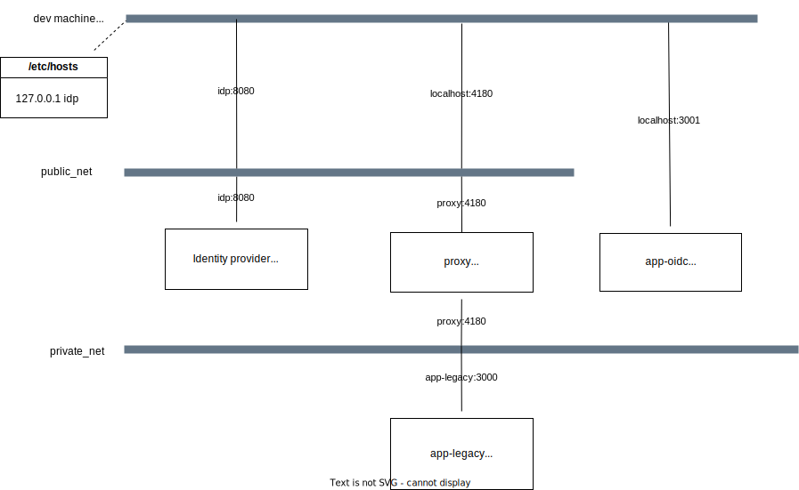

# oidc-poc

## Purpose

Prove of concept for OpenId Connect on a local dev machine.

## Setup

### app-oidc

application supporting openid connect

### app-legacy

application without oidc support

### proxy 

Implementes oidc and is itended to be in front of the app-legacy

### idp

local installation of keycloak

## How to start

Prerequisites:

* docker installation
* access to /etc/hosts

Init

* init networks by using integration/init-networks.sh
* start the idp by using integration/run-idp.sh
* start proxy and app legacy using integration/run-legacy
* modify /etc/hosts to have the right dns for "idp" domain

Use:

* go to http://locahost:4180 -> login with keycloak and use user1:user1 
* go to http://localhost:3000 -> klick on loing and use user1:user1

Configure:

* go to http://idp:8080 -> admin console and login with admin/admin

-> any changes on the configuration are reflected in the code by sharing keycloak db as volume 
